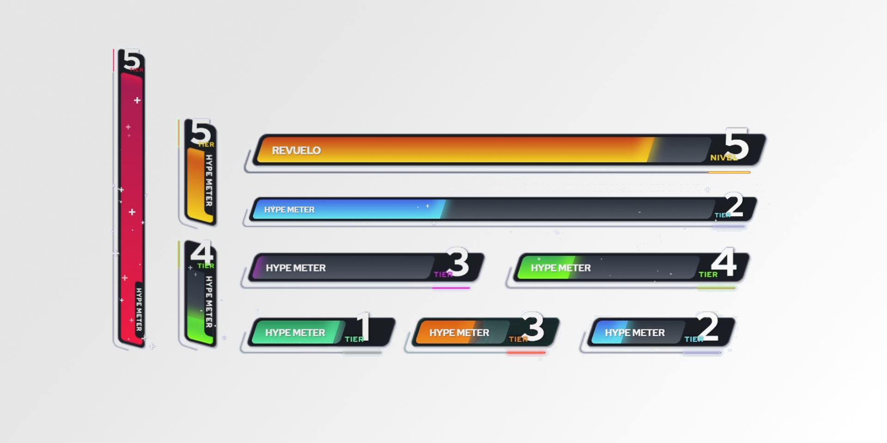

# RCON2.0

## Minimum Viable Product [v0.1.5](https://github.com/JDPlays-Madhouse/RCON2.0/releases/tag/0.1.5)

- [x] Authenticate with twitch.
- [x] Connect to twitch websocket.
- [x] Handle Chat and Channel Point Reward Events.
- [x] Connect to an Rcon Server.
- [x] Send commands to Rcon Server.
- [x] Configure through TOML commands to send to RCON server with defined triggers.

## Requirements

- [x] Read twitch events directly i.e. no Streamer.bot etc.
  - [ ] Events including subs/bits/follows/hype trains
  - [x] Channel Points
  - [x] Chat messages
- [x] Detect certain messages and parse the message for battleship. (Only 1 command)
  - [x] Example: /muppet_streamer_schedule_explosive_delivery target targetPosition
- [x] Convert the parsed message into a valid command.
  - [ ] have default values for commands so invalid data with a valid command
        becomes valid command with default data.
- [ ] Read from SteamLabs/streamelements Patreon (own api) and Humble
      notifications and donations.
- [ ] Read from YouTube for chat/subs/memberships/supers.
- [x] Have a Pause button or Api end point to pause for bio breaks.

- [x] Have a RCON app/interface that takes in specific Factorio commands as well
      as any other games.
- [x] Rcon interface needs to take configurations for any rcon server.
- [ ] Ensure that the amount of data is below the max per tick amount.

  - No obvious method for determining this.

- [ ] Provide visiual feedback through an OBS overlay (website) to give feedback
      on things like the boom factor.
      
- [ ] From twitch events read hype trains and be able to respond.
  - JDGOESBoom with count down, if redeamed again dead factor goes up and
    restart count down.
- [x] Be able to add RCON commands, modify, delete, display (CRUD), including
      default values like deadliness.
- [ ] Be able to test when adding commands.
- [x] Output a log with raw output for debugging
  - [x] ESPECIALLY "custom-reward-id" from twitch channel points as ill need
        that data for adding new points rewards through streamer.bot. Or Work
        out what the ID code.
- [ ] Has to support some sort of user comments in the script so i can keep
      track/notes on new code.

### Definitions

- JD Goes Boom factorio becomes a progress bar, like a power up bar.
- Bar goes up from donations being bits or paypal, ALSO sub points (being sub
  points/2 treated as a number) or any other data that is being captured.
- Progress bar has a Nades, then cluster nade, then arty, then nukes for maximum
  effect.

---

## Integrations

### Twitch

1. Get a Client ID and Client Secret from [dev.twitch.tv/console/apps/](https://dev.twitch.tv/console/apps/).
2. For the redirect url make sure they are exactly the same
   e.g. `http://localhost:27934/twitch/register`. The port can be changed but
   both the dev console and the config file need to match.
3. Run the application once and the config file will generate.
   1. Windows: ~\AppData\roaming\RCON2.0
   2. Linux: ~/.config/RCON2.0
   3. Apple: ~/Library/Application Support/RCON2.0
4. Add the credentials to auth.twitch.
5. websocket_subscription are the websocket events that you want to track defined by
   [twitch docs](https://dev.twitch.tv/docs/eventsub/eventsub-subscription-types/).

#### Current Websocket Subscriptions

If there any not listed that you want, start an issue, and I will add it if possible
[JDPlays-Madhouse/RCON2.0/issues](https://github.com/JDPlays-Madhouse/RCON2.0/issues).

1. channel.chat.message: Twitch Chat Feed.
2. channel.channel_points_custom_reward_redemption.add: Initial reward redemption.
3. channel.channel_points_custom_reward_redemption.update: Amending a reward redemption. (Not Recommended yet)
4. channel.subscribe: New subscribers
5. channel.subscription.message: Re-subscribers

### YouTube

Not yet implemented.

### Patreon

Not yet implemented.

---

## Rcon Commands

At the moment the only way to add commands is through the config file.

```TOML
[example]
prefix = "C"
command_type = "Inline"
inline = "print('Hello, world!')"

[[example.server_triggers]]
enabled = true
server_name = "local"
trigger_type = "Chat"
pattern = "test"

[[example.server_triggers]]
enabled = true
server_name = "local"
trigger_type = "ChannelPointRewardRedeemed"
variant = "New"
title = "Player Goes Boom"
id = "12345678-1234-1234-1234-123456789012"

[[example.server_triggers]]
enabled = true
server_name = "Server Doesn't Exist"
trigger_type = "Chat"
pattern = "This will never trigger nor appear in dashboard, as the server doesn't exist."

["example 2"]
prefix = "C"
command_type = "File"
relative_path = hello_world.lua # or ./hello_world.lua not /wrong.lua

[["example 2".server_triggers]]
enabled = true
server_name = "local"
trigger_type = "Subscription"
```

### Command Name

The command name is defined in the single square brackets.
If you want a space in the name, use quotation marks around the name.

### Prefix

Any text or command that goes before the lua command.

#### Preset

- "C": /command
- "SC": /silent-command
- "MC": /measured-command

#### Custom

For a non preset prefix, type what is required verbatim, including spaces and slashes eg. `/total_custom_prefix `.

> [!IMPORTANT]
> Take note of the trailing slash when using lua.
> Otherwise it will be combined with the first part of the lua script.

### Command Type

#### Inline

This is for lua stored in the config file, ideal for short commands.

```toml
command_type = "Inline"
inline = "print('Hello, world!')"
```

> [!TIP]
> Use Inline when you don't have any lua and just want the prefix.
>
> ```toml
> command_type = "Inline"
> inline = ""
> ```

#### File

This links a lua script in the scripts folder to a command. Ideal for long commands.
The path need to be relative to the scripts config file.

```toml
command_type = "File"
relative_path = hello_world.lua # or ./hello_world.lua not /wrong.lua
```

### Server Triggers

Server triggers are used to define when an event occurs send the command to the server.
To duplicate a server trigger, copy and paste it, then change as required.

```toml
[[example.server_triggers]]
enabled = true
server_name = "local"
trigger_type = "Chat"
pattern = "test"

[[example.server_triggers]]
enabled = true
server_name = "local"
trigger_type = "ChannelPointRewardRedeemed"
title = "Player Goes Boom"
id = "12345678-1234-1234-1234-123456789012"
```

> [!TIP]
> The double square brackets indicate a list/array in toml.

#### Enabled

Used to toggle a server trigger without needing to remove and reinsert.

#### Server Name

The name of the server you want the command to be sent to.

> [!IMPORTANT]
> Must match the exact verbiage used in the core config file, both case and spelling.

#### Trigger

Each `trigger_type` has different properties.

##### Chat

Matches all platforms chat events, matches on exact text. Don't use regex here.

```toml
trigger_type = "Chat"
pattern = "test"
```

Required websocket subscription in main config file.

```toml
websocket_subscription = [
    "channel.chat.message",
]
```

> [!TIP]
> If you want to trigger on every message, set the pattern to "".
>
> ```toml
> trigger_type = "Chat"
> pattern = ""
> ```
>

##### Channel Point Reward Redeemed

Matches just on twitches channel point reward redeemed. Title is the title of the redeem and the id is the twitch ID.

```toml
trigger_type = "ChannelPointRewardRedeemed"
title = "Player Goes Boom"
id = "12345678-1234-1234-1234-123456789012"
variant = "New"
```

Required websocket subscription in main config file.
`Add` for New redemptions and `Update` for when the user update there redemption.

```toml
websocket_subscription = [
    "channel.channel_points_custom_reward_redemption.add",
    "channel.channel_points_custom_reward_redemption.update",
]
```

##### Subscription

Matches any subscription events.

```toml
trigger_type = "Subscription"
```

Required websocket subscription in main config file.

```toml
    "channel.subscribe", # for new subscriptions.
    "channel.subscription.message", # for re-subscriptions.
]
```

> [!NOTE]
> If you want additional options let me know. Tier or sub length etc.

## Known Bugs

- [ ] Cli doesn't work for windows - possible solution [github.com](https://github.com/tauri-apps/tauri/issues/8305#issuecomment-1826871949)
- [ ] On the main page of UI, unable to highlight trigger text in table.
- [ ] Warning log saying, please ignore for now:

  ```text
  3:40:34 pm - WARNING - log - NewEvents emitted without explicit RedrawEventsCleared
  3:40:34 pm - WARNING - log - RedrawEventsCleared emitted without explicit MainEventsCleared
  ```
